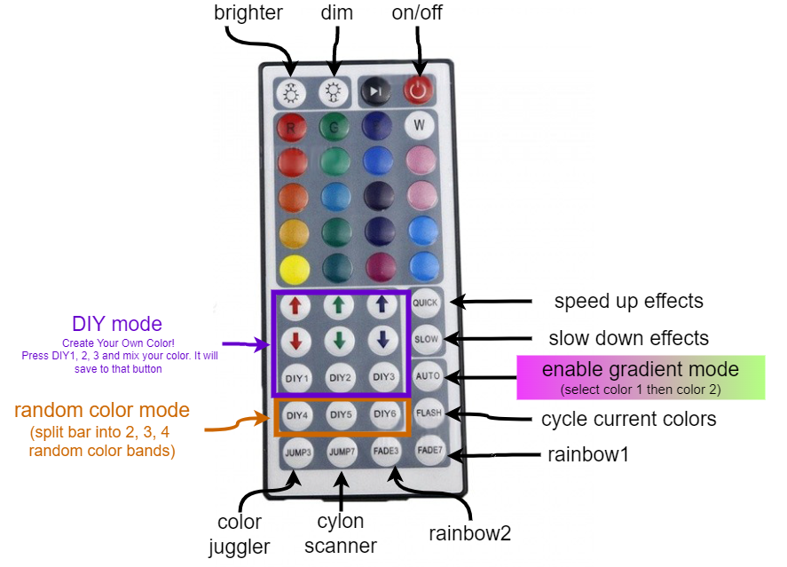
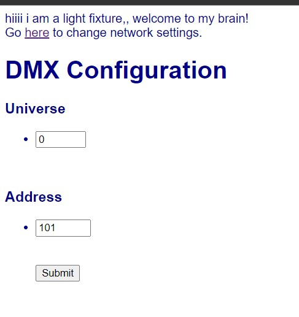
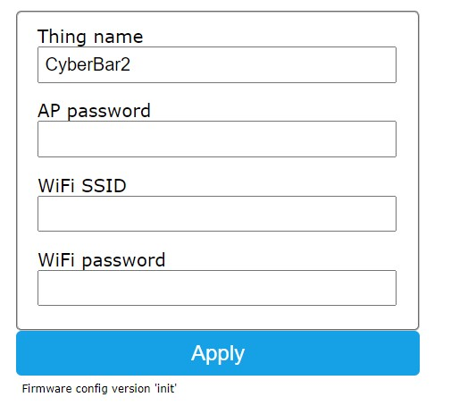
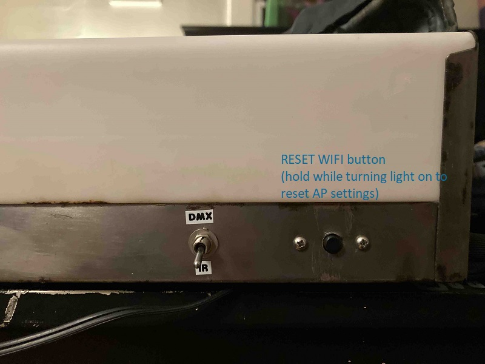
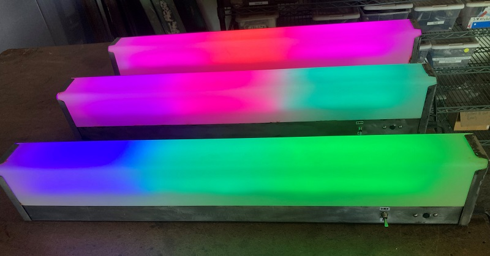
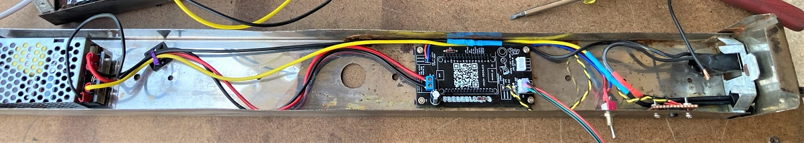
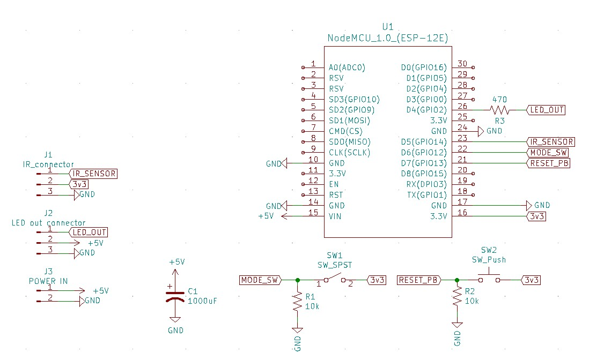
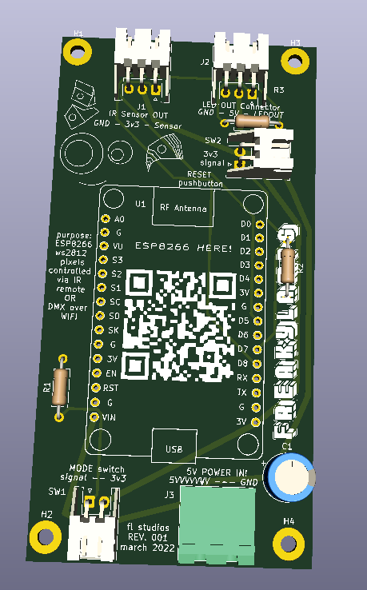

# the cyberbar - wifi artnet/dmx + IR led lighting fixtures 
using ESP8266 for individually addressable LED bars controllable through both IR remote and wifi Artnet network

## User Guide!
Hello and welcome to the *magical* light fixtures that can be controlled via a handy 44 key infrared remote OR from a lighting console, computer, or mobile device via DMX lighting protocol. This is a walkthrough of how to use the lights. 

### IR remote mode

Put switch in IR position and use your 44 key remote! Here is what it does:

### Wifi Artnet/DMX mode
#### WIFI setup 
  - put switch in DMX position
  - It will initially be in "Access Point" mode. Connect to the device as you would connect to a new wifi router. It will be called 'Cyberbar' initially in your wifi setup. 
    - username: CyberBar1 (or 2 or 3)
    - password: password
  - Once you are connected to it, you should be taken to IP address **192.168.4.1** in your browswer. The screen should look like this: 

   
  - ArtNet typically starts at Universe 0! Check your console/lighting program for what universe you start at. 
  - Set the DMX address. 
  - If you want to connect multiple fixtures together, or use this in conjunction with something else, click the link to change the wifi settings. The page will look like this:
  
  - you can change the name of the fixture, and connect to another wifi network using its SSID and Password. This way you can connect many fixutres on the same network, or connect the fixture to the internet to control remotely.  
  - **reset button:** hold while turning on to reset the WIFI network to access point mode. 
 

#### DMX settings
  - set as 3 channel fixtures with 32 pixels in each fixture ([example setup shown here](https://htmlpreview.github.io/?https://github.com/masonandrewmann/danny_lights/blob/master/lightjams_starter/patch.html))
    - color mode = RGB

behold the beauty!

## installation guide for setting up your own:
I am assuming you are using the classic Arduino IDE!
 
IR code was modifed from [dmonty2's wonderful repo](https://github.com/dmonty2/ir_remote_leds)

make sure you install ESP8266 board add-ons for the IDE, [here](https://randomnerdtutorials.com/how-to-install-esp8266-board-arduino-ide/) is instructions on how to do that 

Only tested with ESP8266 using "NodMCU 1.0 (ESP-12E Module)" as the board. 

### required libraries: 
IOT and WIFI stuff: 
 - [IOTWebConf.h](https://github.com/prampec/IotWebConf) // NOTE: This library has been modified so that it stores in EEPROM starting at address 8 instead of 0, use the version included in this repository rather than the official release OR change the line "# define IOTWEBCONF_CONFIG_START 0" to "# define IOTWEBCONF_CONFIG_START 8" in IotWebConf.h in the official release. **The updated file is in library/IotWebConf.h. Move this into your Arduino library folder!**
- [ArtnetWifi.h ](https://github.com/natcl/Artnet) - not to be confused with other artnet wifi libraries,  this is the one to use

LED stuff: 
- [Adafruit_NeoPixel.h](https://github.com/adafruit/Adafruit_NeoPixel)
- [FastLED](https://github.com/FastLED/FastLED)
  
Infrared (IR) reciever stuff: 
- [IRRemoteESP8266](https://github.com/crankyoldgit/IRremoteESP8266)
-  [IRremote](https://github.com/NicoHood/IRLremote)  (outdated?)

Misc Libraries to include: 
- EEPROM.h , should be inheirited from the ESP8266 board library 

### hardware notes
Here are the interals: 

Here is the schematic: 

Included in the repo is a KiCad file for a PCB for the ESP8266:

## pinout for esp8266

LEDPIN          16 // D0    (built in indicator)

BUTTONPIN       13 // D7    (reset button)

MODEPIN         12 // D6    (dmx or IR)

ir recieiver =  14 // D5

led output     2 // D4      (addressable led output)

